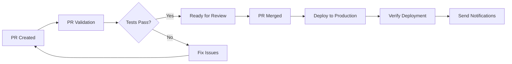

# Vitae DevOps Scaffold 🚀

Automated deployment pipeline for the Vitae project using GitHub Actions and your existing `deploy.ps1` script.

## Quick Start

### 1. Run the Setup Script

```powershell
.\setup-devops.ps1 -ProjectId "your-gcp-project-id"
```

This will:
- ✅ Enable required Google Cloud APIs
- ✅ Create a service account for GitHub Actions
- ✅ Generate service account key
- ✅ Help generate Firebase CI token
- ✅ Update your `.gitignore` file

### 2. Configure GitHub Secrets

Go to your repository **Settings** → **Secrets and variables** → **Actions** and add:

| Secret Name | Value | Description |
|-------------|-------|-------------|
| `GCP_SA_KEY` | Contents of `github-actions-key.json` | Service account credentials |
| `FIREBASE_TOKEN` | Output from `firebase login:ci` | Firebase authentication |
| `GCP_PROJECT_ID` | Your GCP project ID | Target project for deployment |

### 3. Test the Pipeline

1. Create a test branch and push changes
2. Open a pull request to `main`
3. Watch the **PR Validation** workflow run
4. Merge the PR and watch **Deploy to Production** workflow run

## What's Included

### 🔄 GitHub Actions Workflows

- **`.github/workflows/deploy-production.yml`**: Deploys to production on PR merge to main
- **`.github/workflows/pr-validation.yml`**: Validates PRs with comprehensive checks

### 🛠️ Setup Tools

- **`setup-devops.ps1`**: Automated setup script for Google Cloud resources  
- **`.github/DEVOPS_SETUP.md`**: Complete setup guide with troubleshooting

### ✨ Features

- **Automatic Deployment**: Deploy on every merge to main
- **Manual Deployment**: Trigger deployments with custom parameters
- **PR Validation**: Syntax checking, dependency validation, security scans
- **Rollback Support**: Manual workflow dispatch with options
- **Security First**: Service account-based authentication, secret management

## Workflow Overview



### On Pull Request:
- ✅ Validate PowerShell script syntax
- ✅ Check Firebase configuration 
- ✅ Install and validate dependencies
- ✅ Validate Terraform configuration
- ✅ Run security scans
- ✅ Test deployment parameters

### On Merge to Main:
- 🚀 Setup Node.js, Terraform, Firebase CLI
- 🔐 Authenticate with Google Cloud & Firebase
- 📦 Install dependencies
- 🎯 Run your `deploy.ps1` script with production settings
- ✅ Verify deployment success
- 📊 Report deployment status

## Manual Deployment Options

Trigger deployments manually with custom parameters:

1. Go to **Actions** → **Deploy to Production** → **Run workflow**
2. Choose options:
   - **Environment**: `prod` or `local`
   - **Skip Terraform**: Skip infrastructure deployment
   - **Skip Firebase**: Skip Firebase deployment  
   - **Functions Only**: Deploy only Firebase Functions

## Your Existing `deploy.ps1` Integration

The DevOps scaffold perfectly integrates with your existing deployment script:

```powershell
# GitHub Actions calls your script like this:
.\deploy.ps1 -Environment prod -ProjectId $PROJECT_ID -SkipEmulatorCleanup
```

All your existing parameters and functionality work seamlessly:
- ✅ Environment switching (`local`/`prod`)
- ✅ Component selection (Terraform, Firebase, Functions)
- ✅ Project ID auto-detection
- ✅ Comprehensive error handling
- ✅ Deployment verification

## Security & Best Practices

### 🔐 Authentication
- Service account-based authentication (no personal credentials)
- Scoped permissions (only what's needed for deployment)
- Secret-based token management

### 🛡️ Security
- Automatic key rotation reminders
- Security scanning in PR validation
- No hardcoded credentials
- Protected main branch (coming soon)

### 📊 Monitoring
- Deployment status notifications
- Comprehensive logging
- Post-deployment verification
- Rollback capabilities

## Project Structure

```
vitae/
├── .github/
│   ├── workflows/
│   │   ├── deploy-production.yml    # Main deployment workflow
│   │   └── pr-validation.yml        # PR validation workflow
│   └── DEVOPS_SETUP.md             # Detailed setup guide
├── deploy.ps1                      # Your existing deployment script (unchanged)
├── setup-devops.ps1                # Automated DevOps setup
└── DEVOPS_README.md                # This file
```

## Quick Commands

```powershell
# Initial setup
.\setup-devops.ps1 -ProjectId "your-project-id"

# Test deployment locally (existing command)
.\deploy.ps1 -Environment local

# Test production parameters (existing command)  
.\deploy.ps1 -Environment prod -ProjectId "your-project" -SkipTerraform

# Generate new Firebase token
firebase login:ci

# Check service account permissions
gcloud projects get-iam-policy your-project-id
```

## Troubleshooting

### Common Issues

**Authentication Errors**: Check that `GCP_SA_KEY` secret contains the complete JSON
**Permission Errors**: Verify service account has all required roles
**Firebase Errors**: Regenerate Firebase token with `firebase login:ci`

### Getting Help

1. Check the workflow logs in the Actions tab
2. Review the detailed setup guide: `.github/DEVOPS_SETUP.md`
3. Test deployment locally first: `.\deploy.ps1 -Environment prod`

---

## Next Steps

After setup is complete:

1. **Enable Branch Protection**: Require PR validation to pass
2. **Add Notifications**: Configure Slack/email notifications 
3. **Add Staging**: Create staging environment workflow
4. **Monitor Deployments**: Set up monitoring and alerting

Happy deploying! 🎉 